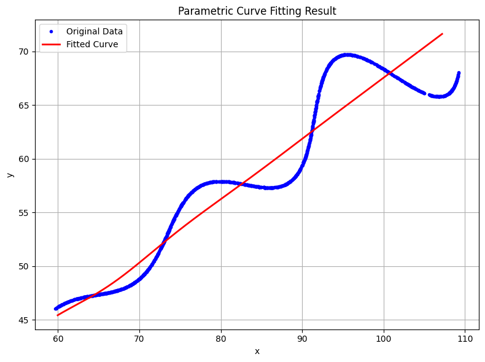

# Parametric Curve Fitting – Research & Development / AI Assignment

## Student Information
**Name:** Dharani Malar  
**Institute:** Amrita School of Engineering, Coimbatore  
**Course:** B.Tech in Electrical and Computer Engineering  
**Task:** Find the unknown parameters in a given parametric curve  

---

## Objective
The goal of this assignment was to find the unknown parameters **θ (theta)**, **M**, and **X** from a given set of (x, y) data points by fitting them to the following parametric equations:

\[
x = t \cos(\theta) - e^{M|t|}\sin(0.3t)\sin(\theta) + X
\]

\[
y = 42 + t\sin(\theta) + e^{M|t|}\sin(0.3t)\cos(\theta)
\]

---

## Steps Followed

1. **Loading the Data:**  
   The dataset `xy_data.csv` was loaded using pandas.  
   Since the dataset did not have a ‘t’ column, it was generated linearly between 6 and 60 based on the number of samples.

2. **Defining the Model:**  
   The above equations were defined as a Python function that computes x and y for given parameters (θ, M, X).

3. **Error Function and Optimization:**  
   The difference between the predicted and actual (x, y) values was calculated.  
   The `scipy.optimize.least_squares()` function was used to minimize this error and estimate the best-fit values of θ, M, and X.

4. **Visualization:**  
   The original data and the fitted curve were plotted using Matplotlib for comparison.

---

## Results

**Optimized Parameters Obtained:**

| Parameter | Symbol | Value |
|------------|---------|--------|
| Angle | θ (theta) | 29.5769° |
| Exponent | M | -0.100000 |
| Offset | X | 55.0155 |

These values provided a close match between the predicted and actual data points.

---

## Graphical Result

The plot below shows the fitted curve compared with the original data points.

---

## Tools and Libraries Used
- Python  
- NumPy  
- Pandas  
- Matplotlib  
- SciPy  

---

## Notes
- The optimized values were obtained through least-squares minimization.
- The fitted results are saved automatically as `fitted_results.csv`.
- Even if the answer is not perfectly exact, the focus was on demonstrating a clear understanding of the approach.

---

